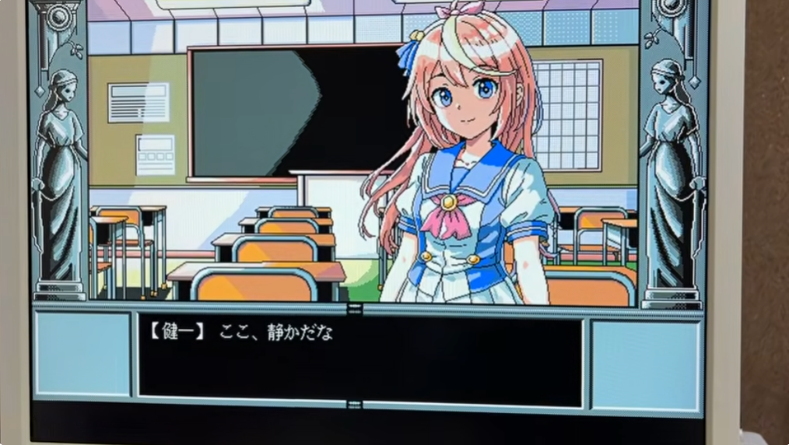
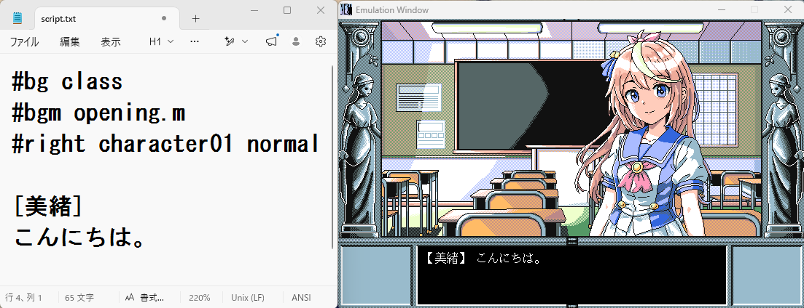

# ADV98.EXE

NEC PC-9801 / PC-9821 シリーズ向け  
16色ADVゲームエンジン（開発中）

90年代 PC-98 ADV風ゲームを作成することを目的とした、スクリプト型ADVエンジンです。

## 動画

ChatGPT と Codex を使って開発したPC-98 ADVゲームエンジンの実機動作動画です。

## スクリーンショット

### スクリプトで動くADVゲームエンジン

## 機能

- 背景表示
- 立ち絵表示
- メッセージ表示
- 選択肢
- 分岐
- save/load
- PMD BGM対応

スクリプト命令一覧、実装詳細、画像変換ツールなどについては開発ブログに掲載しています。
- [PC-98ノベルゲームエンジン開発：スクリプト命令まとめ](https://pokug.net/entry/2026/05/03/233421/)

## 動作確認環境

### OS
- NEC PC-9800シリーズ MS-DOS 6.2
- NEC PC-9800シリーズ MS-DOS 5.0A-H

### 実機
- PC-9821Ra43 + PC-9801-86
- PC-9821V13  + PC-9801-118（非PnPモード）

### エミュレータ
- T98-NEXT

## 開発環境

- ia16-elf-gcc
- WSL Ubuntu
- VS Code
- ChatGPT + Codex

## About

このプロジェクトは、ChatGPT と Codex を使用し開発しています。

AI は：

- コード生成（99%以上）
- デバッグ
- 実装支援

などに利用しています。

全体設計、統合、素材制作、最終判断は作者が行っています。

## 必須ファイル

- ADV98.EXE
- script.txt

## オプション機能

### FM音源出力

KAJA氏によって開発された  PMD（PC-98用 FM音源音楽ドライバ）を常駐すると、BGM機能が有効になります。

未常駐時でもゲーム本編は動作します。

### マウス操作

MS-DOS標準のマウスドライバを組み込むと、
マウスカーソルは表示されませんが、
左クリックで文字送りが可能になります。

未常駐でも動作します。  
その場合はキーボード操作のみになります。

## debug.txt

ファイル読み込み失敗時などの情報を
debug.txt に出力します。

## 現在の状態

開発中です。  
仕様は変更される可能性があります。

## Blog

開発記録：
- [会社で AIコーディングの情報収集をしろと言われた結果、PC-98 ADV ゲームを作り始めた話](https://pokug.net/entry/2026/05/10/210032/)

## License

MIT License
